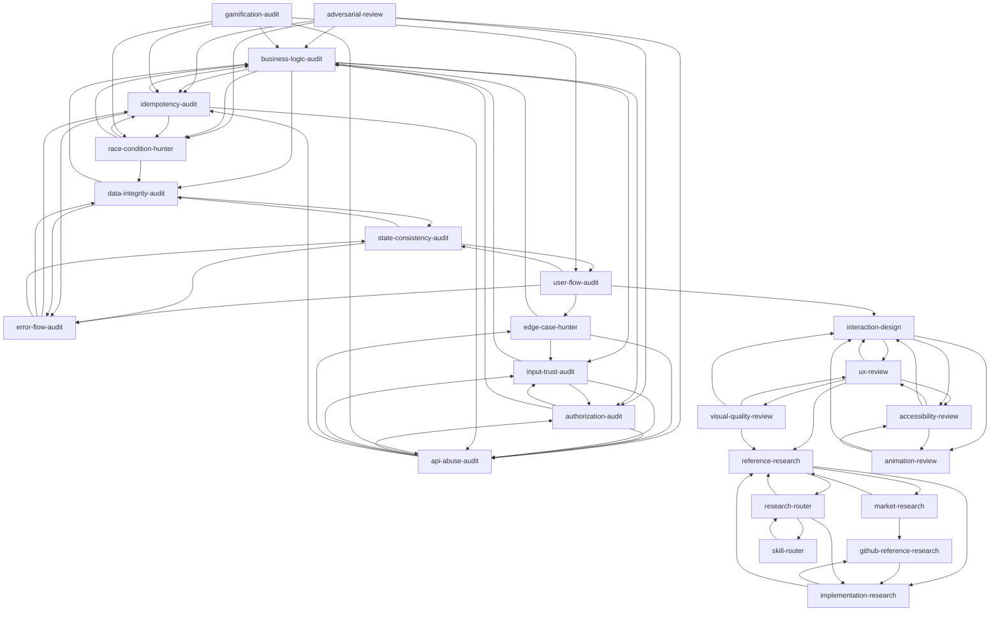

# Skill Composition Graph

> Auto-generated by `node bin/cli.js graph`. Do not edit manually.
> Run `node bin/cli.js graph --out docs/skill-graph.md` to regenerate.

```mermaid
graph TD
    adversarial-review[adversarial-review] --> business-logic-audit[business-logic-audit]
    adversarial-review[adversarial-review] --> race-condition-hunter[race-condition-hunter]
    adversarial-review[adversarial-review] --> idempotency-audit[idempotency-audit]
    adversarial-review[adversarial-review] --> authorization-audit[authorization-audit]
    adversarial-review[adversarial-review] --> api-abuse-audit[api-abuse-audit]
    user-flow-audit[user-flow-audit] --> state-consistency-audit[state-consistency-audit]
    user-flow-audit[user-flow-audit] --> error-flow-audit[error-flow-audit]
    user-flow-audit[user-flow-audit] --> edge-case-hunter[edge-case-hunter]
    user-flow-audit[user-flow-audit] --> interaction-design[interaction-design]
    business-logic-audit[business-logic-audit] --> idempotency-audit[idempotency-audit]
    business-logic-audit[business-logic-audit] --> race-condition-hunter[race-condition-hunter]
    business-logic-audit[business-logic-audit] --> data-integrity-audit[data-integrity-audit]
    business-logic-audit[business-logic-audit] --> authorization-audit[authorization-audit]
    business-logic-audit[business-logic-audit] --> input-trust-audit[input-trust-audit]
    edge-case-hunter[edge-case-hunter] --> input-trust-audit[input-trust-audit]
    edge-case-hunter[edge-case-hunter] --> api-abuse-audit[api-abuse-audit]
    edge-case-hunter[edge-case-hunter] --> business-logic-audit[business-logic-audit]
    state-consistency-audit[state-consistency-audit] --> user-flow-audit[user-flow-audit]
    state-consistency-audit[state-consistency-audit] --> data-integrity-audit[data-integrity-audit]
    state-consistency-audit[state-consistency-audit] --> error-flow-audit[error-flow-audit]
    error-flow-audit[error-flow-audit] --> idempotency-audit[idempotency-audit]
    error-flow-audit[error-flow-audit] --> data-integrity-audit[data-integrity-audit]
    error-flow-audit[error-flow-audit] --> state-consistency-audit[state-consistency-audit]
    authorization-audit[authorization-audit] --> input-trust-audit[input-trust-audit]
    authorization-audit[authorization-audit] --> business-logic-audit[business-logic-audit]
    authorization-audit[authorization-audit] --> api-abuse-audit[api-abuse-audit]
    api-abuse-audit[api-abuse-audit] --> authorization-audit[authorization-audit]
    api-abuse-audit[api-abuse-audit] --> input-trust-audit[input-trust-audit]
    api-abuse-audit[api-abuse-audit] --> edge-case-hunter[edge-case-hunter]
    api-abuse-audit[api-abuse-audit] --> idempotency-audit[idempotency-audit]
    input-trust-audit[input-trust-audit] --> authorization-audit[authorization-audit]
    input-trust-audit[input-trust-audit] --> api-abuse-audit[api-abuse-audit]
    input-trust-audit[input-trust-audit] --> business-logic-audit[business-logic-audit]
    race-condition-hunter[race-condition-hunter] --> idempotency-audit[idempotency-audit]
    race-condition-hunter[race-condition-hunter] --> data-integrity-audit[data-integrity-audit]
    race-condition-hunter[race-condition-hunter] --> business-logic-audit[business-logic-audit]
    idempotency-audit[idempotency-audit] --> race-condition-hunter[race-condition-hunter]
    idempotency-audit[idempotency-audit] --> error-flow-audit[error-flow-audit]
    idempotency-audit[idempotency-audit] --> api-abuse-audit[api-abuse-audit]
    idempotency-audit[idempotency-audit] --> business-logic-audit[business-logic-audit]
    data-integrity-audit[data-integrity-audit] --> business-logic-audit[business-logic-audit]
    data-integrity-audit[data-integrity-audit] --> state-consistency-audit[state-consistency-audit]
    data-integrity-audit[data-integrity-audit] --> error-flow-audit[error-flow-audit]
    gamification-audit[gamification-audit] --> business-logic-audit[business-logic-audit]
    gamification-audit[gamification-audit] --> idempotency-audit[idempotency-audit]
    gamification-audit[gamification-audit] --> race-condition-hunter[race-condition-hunter]
    gamification-audit[gamification-audit] --> api-abuse-audit[api-abuse-audit]
    gamification-audit[gamification-audit] --> user-flow-audit[user-flow-audit]
    ux-review[ux-review] --> interaction-design[interaction-design]
    ux-review[ux-review] --> accessibility-review[accessibility-review]
    ux-review[ux-review] --> visual-quality-review[visual-quality-review]
    ux-review[ux-review] --> reference-research[reference-research]
    visual-quality-review[visual-quality-review] --> ux-review[ux-review]
    visual-quality-review[visual-quality-review] --> interaction-design[interaction-design]
    visual-quality-review[visual-quality-review] --> reference-research[reference-research]
    interaction-design[interaction-design] --> ux-review[ux-review]
    interaction-design[interaction-design] --> animation-review[animation-review]
    interaction-design[interaction-design] --> accessibility-review[accessibility-review]
    animation-review[animation-review] --> interaction-design[interaction-design]
    animation-review[animation-review] --> accessibility-review[accessibility-review]
    accessibility-review[accessibility-review] --> ux-review[ux-review]
    accessibility-review[accessibility-review] --> interaction-design[interaction-design]
    accessibility-review[accessibility-review] --> animation-review[animation-review]
    reference-research[reference-research] --> market-research[market-research]
    reference-research[reference-research] --> implementation-research[implementation-research]
    reference-research[reference-research] --> research-router[research-router]
    github-reference-research[github-reference-research] --> implementation-research[implementation-research]
    market-research[market-research] --> reference-research[reference-research]
    market-research[market-research] --> github-reference-research[github-reference-research]
    implementation-research[implementation-research] --> github-reference-research[github-reference-research]
    implementation-research[implementation-research] --> reference-research[reference-research]
    skill-router[skill-router] --> research-router[research-router]
    research-router[research-router] --> skill-router[skill-router]
    research-router[research-router] --> reference-research[reference-research]
    research-router[research-router] --> implementation-research[implementation-research]
```