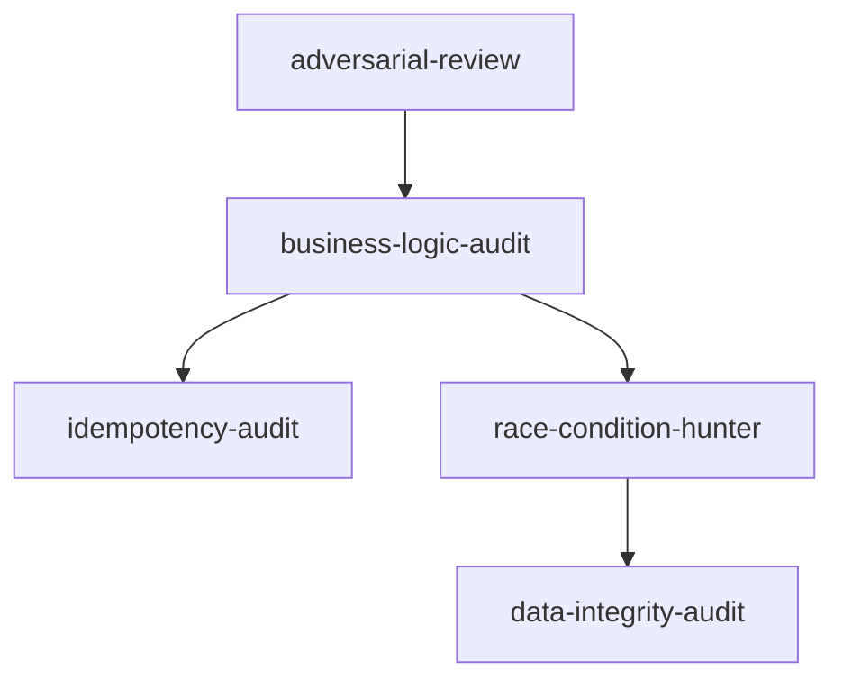

# Plan: Roadmap para levar o Agent Engineering Skills a 10/10

**Status do plano:** pós-v1  
**Última revisão:** 2026-08-28  
**Objetivo:** transformar o repositório de uma coleção de skills muito bem estruturada em um sistema de skills mensurável, portátil, testado, seguro, reproduzível e fácil de evoluir.

> Don't just review the code. Attack the assumptions behind the system.

---

# 1. Estado atual

O projeto já possui uma base forte:

* 24 skills organizadas por domínio.
* Contrato consistente de `SKILL.md`.
* 9 seções obrigatórias por skill.
* `skill-router` e `research-router`.
* Catálogos centralizados de referências.
* `AGENTS.md` com princípios globais.
* CLI própria sem dependências de runtime.
* Validador estrutural.
* Templates de relatórios.
* Exemplos de auditoria.
* Separação conceitual entre `skills/`, `knowledge/` e `references/`.

O próximo salto de qualidade não deve vir de adicionar mais skills.

O que falta agora é provar que o sistema funciona melhor do que um agente sem essas skills, reduzir duplicação e over-routing, melhorar interoperabilidade, transformar `knowledge/` em uma camada real, criar testes automatizados e estabelecer uma disciplina de release.

---

# 2. Regra principal desta fase

Até as fases P0 estarem concluídas:

> **Não adicionar novas skills apenas por cobertura aparente.**

Uma nova skill só deve entrar quando pelo menos uma destas condições for verdadeira:

1. um eval real demonstra um gap de cobertura;
2. uma skill existente está assumindo responsabilidades incompatíveis;
3. o novo comportamento aumenta recall ou precisão de forma mensurável;
4. existe um domínio recorrente que não pode ser representado adequadamente por composição.

Se duas skills produzem os mesmos findings na maioria dos casos, o problema deve ser resolvido por:

* fronteira de responsabilidade;
* metadata;
* composição;
* deduplicação;
* ou fusão.

Quantidade de skills não é métrica de qualidade.

---

# 3. Definição de 10/10

O projeto será considerado 10/10 quando satisfizer todos os gates abaixo.

## 3.1 Eficácia

* [ ] Existe uma suíte de evals reproduzível.
* [ ] Existe baseline sem as skills.
* [ ] Existe benchmark com as skills.
* [ ] O projeto demonstra melhoria mensurável sobre o baseline.
* [ ] Findings críticos não dependem apenas de exemplos escritos para a própria skill.

## 3.2 Routing

* [x] O router seleciona o menor conjunto suficiente de skills.
* [x] Há métricas de precision e recall do routing.
* [x] Há proteção contra skill explosion.
* [x] A seleção é derivada de metadata estruturada.
* [x] O router não depende de tabelas manuais duplicadas em vários lugares.

## 3.3 Qualidade dos findings

* [ ] `CONFIRMED`, `HIGH CONFIDENCE`, `POSSIBLE` e `SPECULATIVE` são avaliados em testes.
* [ ] Hipóteses sem evidência não aparecem como bugs confirmados.
* [ ] Findings duplicados são consolidados.
* [ ] Findings têm mecanismo, impacto e evidência rastreáveis.

## 3.4 Portabilidade

* [ ] O formato fonte é compatível com o padrão aberto de Agent Skills.
* [ ] O repo instala corretamente por ferramentas genéricas do ecossistema.
* [ ] Claude Code continua suportado.
* [ ] Pelo menos três clientes adicionais possuem smoke tests documentados.

## 3.5 Tooling

* [ ] O CLI possui testes automatizados.
* [ ] `--force` possui proteções contra remoção perigosa.
* [ ] Existe `--dry-run`.
* [ ] Existe um comando de diagnóstico.
* [ ] Instalação e validação rodam em CI.

## 3.6 Conhecimento

* [ ] `knowledge/` deixa de ser apenas estrutura vazia.
* [ ] Skills usam conhecimento compartilhado via progressive disclosure.
* [ ] Conhecimento duplicado entre skills é reduzido.

## 3.7 Referências

* [ ] URLs possuem checagem automatizada de saúde.
* [ ] Referências possuem data de verificação.
* [ ] Fontes obsoletas podem ser detectadas.
* [ ] Research diferencia fonte oficial, implementação real, opinião e inspiração.

## 3.8 Open source

* [ ] Há CI pública.
* [ ] Há `CONTRIBUTING.md`.
* [ ] Há `SECURITY.md`.
* [ ] Há `CHANGELOG.md`.
* [ ] Há política de versionamento.
* [ ] Há release `v1.0.0`.
* [ ] O GitHub possui description e topics adequados.

## 3.9 Reprodutibilidade

* [ ] Uma mudança de skill pode ser comparada contra a versão anterior.
* [ ] Uma nova skill precisa trazer novos evals.
* [ ] Uma regressão de routing ou findings bloqueia merge.
* [ ] Os resultados do benchmark podem ser reproduzidos por outra pessoa.

---

# 4. Prioridades

## P0: obrigatório antes de expandir o projeto

1. Evals.
2. Metadata e catálogo de skills.
3. Router baseado em catálogo.
4. CI.
5. Testes do CLI.
6. Proteções de instalação.

## P1: necessário para chegar a 10/10

1. Interoperabilidade Agent Skills.
2. Knowledge layer real.
3. Reference health.
4. Deduplicação formal de findings.
5. Documentação de arquitetura.
6. Release process.

## P2: refinamento

1. Grafo visual de skills.
2. Benchmark publicado.
3. Comandos `doctor`, `list`, `graph` e `eval`.
4. Matriz pública de compatibilidade.
5. Skill lifecycle.
6. Melhorias de discoverability.

---

# 5. Fase P0.1: criar a suíte de evals

Este é o item mais importante do roadmap.

Hoje o projeto valida estrutura. Ele precisa passar a validar comportamento.

## 5.1 Estrutura proposta

```text
evals/
├── README.md
├── schema.json
├── cases/
│   ├── routing/
│   ├── audit/
│   ├── security/
│   ├── reliability/
│   ├── product/
│   ├── frontend/
│   ├── research/
│   └── mixed/
├── fixtures/
├── baselines/
├── expected/
└── results/

scripts/
└── eval.py
```

## 5.2 Formato mínimo de um caso

Cada eval deve representar uma situação que o agente pode encontrar no mundo real.

```yaml
id: duplicate-reward-001
title: reward can be farmed by repeat/remove/repeat

task: |
  Audit a reaction system where each new reaction grants XP.

context:
  - reaction can be removed
  - XP is granted on create
  - no reward ledger exists

risk: high

expected_skills:
  required:
    - gamification-audit
    - business-logic-audit
  useful:
    - idempotency-audit
  forbidden:
    - animation-review

expected_findings:
  - reward can be repeatedly earned after reversal

forbidden_claims:
  - race condition is confirmed without concurrency evidence

expected_confidence:
  reward-loop: high-confidence
```

## 5.3 Métricas de routing

Medir:

```text
routing_precision
routing_recall
critical_skill_recall
over_routing_rate
average_skills_selected
unnecessary_skill_count
missing_required_skill_count
```

### Gates iniciais

* [x] `critical_skill_recall = 100%` nos casos críticos da suíte.
* [x] `routing_precision >= 90%`.
* [x] `routing_recall >= 90%`.
* [x] tarefas triviais selecionam no máximo 1 skill.
* [x] tarefas médias selecionam normalmente 1 ou 2 skills.
* [x] tarefas de alto risco selecionam normalmente 2 a 4 skills.
* [x] conjuntos maiores exigem justificativa explícita.

Os thresholds podem evoluir quando houver dados suficientes, mas devem existir para impedir regressões silenciosas.

## 5.4 Métricas de findings

Medir:

```text
finding_precision
finding_recall
critical_finding_recall
duplicate_finding_rate
unsupported_confirmation_rate
confidence_calibration
```

### Gates iniciais

* [x] Nenhum finding sem mecanismo é classificado como `CONFIRMED` (contrato determinístico).
* [x] Nenhum finding sem evidência forte é promovido silenciosamente (contrato determinístico).
* [ ] Findings críticos conhecidos são encontrados end-to-end (depende de execução de modelo externo).
* [x] O mesmo bug descoberto por várias skills aparece uma vez no relatório final.
* [x] O relatório preserva quais skills contribuíram para o finding.

## 5.5 Baseline

Para cada benchmark relevante, comparar pelo menos:

```text
A: agente sem skills
B: agente com uma skill específica
C: agente com skill-router e composição
```

Quando possível, adicionar:

```text
D: router + research-router
```

A pergunta central do projeto passa a ser:

> O sistema de skills melhora a qualidade do agente de forma mensurável?

## 5.6 Casos mínimos para a primeira suíte

Criar pelo menos 30 casos:

| Domínio | Casos mínimos |
| --- | ---: |
| Audit | 5 |
| Security | 5 |
| Reliability | 5 |
| Product | 4 |
| Frontend | 5 |
| Research | 3 |
| Mixed | 3 |

Os exemplos existentes podem virar seeds, mas não devem ser a única fonte dos evals.

Adicionar também casos negativos, onde a resposta correta é não reportar bug.

## 5.7 Regra para mudanças futuras

Toda alteração comportamental em uma skill deve:

1. adicionar ou atualizar pelo menos um eval relevante;
2. rodar contra a baseline atual;
3. demonstrar que não piora outro domínio;
4. registrar mudança de métricas quando houver impacto.

### Definition of Done da fase

* [x] `evals/` existe.
* [x] Há 30 ou mais casos.
* [x] Há casos positivos e negativos.
* [x] Há métricas de routing.
* [x] Há métricas de findings.
* [ ] Há baseline end-to-end sem skills (depende de execução de modelo externo; baseline determinístico de routing já existe).
* [x] Existe comando reproduzível para rodar os evals.
* [x] Resultados podem ser salvos em JSON.

---

# 6. Fase P0.2: criar um catálogo estruturado de skills

Hoje parte da lógica de routing existe no frontmatter e parte existe dentro do `skill-router`.

Isso cria risco de drift.

Criar uma única fonte de verdade para relações entre skills.

## 6.1 Estrutura proposta

```text
catalog/
└── skills.yaml
```

Exemplo:

```yaml
- name: race-condition-hunter
  category: reliability
  role: verifier
  priority: high
  risk_floor: medium

  triggers:
    - concurrency
    - simultaneous mutation
    - double spend
    - shared mutable state

  requires_signals:
    - shared-state

  composes_with:
    - idempotency-audit
    - data-integrity-audit
    - business-logic-audit

  overlaps_with:
    - adversarial-review

  reasoning_cost: medium
  research_cost: low
```

## 6.2 Roles obrigatórios

Cada skill deve declarar uma função principal:

```text
generator
investigator
verifier
reviewer
researcher
router
```

Exemplos:

```text
adversarial-review        generator
business-logic-audit      investigator
race-condition-hunter     verifier
accessibility-review      reviewer
implementation-research   researcher
skill-router              router
```

Isso permite ordenar composição sem depender apenas de texto manual.

## 6.3 Campos recomendados

```text
name
category
role
priority
risk_floor
triggers
requires_signals
composes_with
overlaps_with
reasoning_cost
research_cost
```

Evitar metadata que não altere routing, execução ou manutenção.

## 6.4 Fonte `SKILL.md`

O `SKILL.md` deve permanecer focado em:

* discovery pelo agente;
* raciocínio;
* investigação;
* evidência;
* falso positivo;
* formato de saída.

Relações globais entre skills devem ficar no catálogo.

## 6.5 Compatibilidade com Agent Skills

Migrar o frontmatter fonte para um formato compatível com o padrão aberto.

Exemplo:

```yaml
---
name: race-condition-hunter
description: Detects race conditions and unsafe read-decide-write flows. Use when concurrent requests can mutate shared state, balances, counters, rewards, inventory, quotas, or state transitions.
license: MIT
metadata:
  aes-category: reliability
  aes-role: verifier
  aes-priority: high
---
```

Metadata rica com listas continua no catálogo.

Isso evita depender de campos top-level proprietários como:

```text
category
triggers
priority
```

## 6.6 Validação

Atualizar `scripts/validate.py` para verificar:

* [x] toda skill possui entrada no catálogo;
* [x] toda entrada no catálogo possui `SKILL.md`;
* [x] `name` é único;
* [x] `composes_with` aponta para skills existentes;
* [x] `overlaps_with` aponta para skills existentes;
* [x] `role` pertence ao enum;
* [x] `category` pertence ao enum;
* [x] `priority` pertence ao enum;
* [x] `risk_floor` pertence ao enum;
* [x] nenhuma dependência circular impossível existe (autorreferência é erro; `composes_with`/`overlaps_with` são relações simétricas e podem ser mútuas);
* [x] descriptions seguem o padrão Agent Skills;
* [x] frontmatter fonte é compatível com a especificação aberta.

### Definition of Done da fase

* [x] `catalog/skills.yaml` é a fonte de verdade.
* [x] As 24 skills estão catalogadas.
* [x] O validador detecta drift.
* [x] O frontmatter fonte é portátil.
* [x] O router pode ser gerado ou orientado pelo catálogo.

---

# 7. Fase P0.3: reescrever o skill-router para evitar skill explosion

O router deve otimizar para:

> menor conjunto suficiente para falsificar as suposições relevantes.

Não para:

> maior cobertura possível.

## 7.1 Skill budget

Adicionar um budget explícito.

```text
trivial:
  0 ou 1

medium:
  1 ou 2

high:
  2 a 4

critical:
  3 a 6
```

Exceder o budget é permitido apenas quando houver razão concreta.

## 7.2 Scoring

Cada candidata pode receber score por:

```text
trigger_match
domain_match
risk_match
required_signal
composition_bonus
overlap_penalty
cost_penalty
```

Modelo conceitual:

```text
score =
  trigger_match
  + domain_match
  + risk_match
  + composition_bonus
  - overlap_penalty
  - unnecessary_cost
```

Não é necessário transformar isso em machine learning.

O objetivo é tornar a decisão rastreável.

## 7.3 Não listar todas as skills rejeitadas

A saída atual pode gerar overhead ao explicar cada skill não selecionada.

Trocar por:

```text
Selected
Near misses
Research routing
```

`Near misses` deve conter no máximo 3 skills que realmente poderiam parecer relevantes.

## 7.4 Ordem de execução

Usar o `role`:

```text
generator
↓
investigator
↓
verifier
↓
reviewer
↓
researcher quando necessário
```

Research pode acontecer antes quando a incerteza for o problema principal.

## 7.5 Deduplicação de cobertura

Antes de selecionar uma skill adicional, perguntar:

```text
Ela adiciona uma nova lente?
Ela aumenta capacidade de confirmação?
Ela cobre um risco ainda não coberto?
Ou apenas repete outra skill?
```

Se apenas repetir, não selecionar.

## 7.6 Avaliação

Criar evals específicos para:

* [ ] under-routing;
* [ ] over-routing;
* [ ] tarefas triviais;
* [ ] tarefas mistas;
* [ ] security + reliability;
* [ ] frontend + research;
* [ ] prompt vago;
* [ ] prompt com palavras ambíguas;
* [ ] problema crítico sem trigger literal.

### Definition of Done da fase

* [x] Router usa catálogo.
* [x] Skill budget existe.
* [x] Over-routing é medido.
* [x] Relações entre skills não ficam duplicadas em tabelas manuais.
* [x] Routing crítico passa pelos evals.
* [x] A saída é menor e mais informativa.

---

# 8. Fase P0.4: formalizar deduplicação de findings

Skills sobrepostas são aceitáveis.

Relatórios duplicados não são.

## 8.1 Identidade de finding

Um finding deve ser normalizado por:

```text
affected_component
invariant
mechanism
state_transition
impact
```

Duas skills podem descobrir o mesmo problema por caminhos diferentes.

O agregador deve produzir:

```text
Finding único
Contributing skills
Evidence merged
Highest justified confidence
```

## 8.2 Regra de confidence

Nunca usar simplesmente o maior confidence produzido por qualquer skill.

A confidence final deve ser recalculada a partir da evidência consolidada.

Exemplo:

```text
3 skills disseram CONFIRMED
+
nenhuma reprodução
=
não é CONFIRMED
```

## 8.3 Provenance

Cada finding final deve preservar:

```text
generated_by
investigated_by
verified_by
evidence
```

### Definition of Done da fase

* [x] Relatórios não repetem o mesmo bug (consolidator determinístico + fixtures).
* [x] Confidence depende de evidência.
* [x] Provenance de skill é preservado.
* [x] Existem evals de duplicação.

---

# 9. Fase P0.5: adicionar CI

O repositório deve validar cada PR automaticamente.

## 9.1 Estrutura

```text
.github/
└── workflows/
    ├── ci.yml
    ├── reference-health.yml
    └── release.yml
```

## 9.2 `ci.yml`

Rodar em:

```text
push
pull_request
```

Checks:

1. `python3 scripts/validate.py`
2. testes do CLI;
3. instalação em diretório temporário;
4. instalação com `--link`;
5. instalação com `--force`;
6. `npm pack --dry-run`;
7. validação Agent Skills;
8. evals determinísticos de routing;
9. verificação de arquivos gerados.

Matriz mínima:

```text
ubuntu-latest
node 18
node 20
node 22
python 3.11+
```

Adicionar outros sistemas apenas quando houver benefício real.

## 9.3 Branch protection

Configurar no GitHub:

* [ ] CI obrigatório.
* [ ] merge bloqueado quando validator falha.
* [ ] merge bloqueado quando eval crítico falha.
* [ ] branch `main` protegida.

### Definition of Done da fase

* [ ] PRs têm checks automáticos.
* [ ] `main` não aceita regressão estrutural.
* [ ] Routing crítico é testado antes de merge.

---

# 10. Fase P0.6: testar e endurecer o CLI

O CLI é parte do produto.

Ele precisa do mesmo rigor das skills.

## 10.1 Testes com `node:test`

Criar:

```text
test/
├── cli-install.test.js
├── cli-force.test.js
├── cli-link.test.js
├── cli-target.test.js
├── cli-frontmatter.test.js
└── cli-errors.test.js
```

Usar apenas APIs nativas do Node para preservar zero dependencies.

## 10.2 Proteções para `--force`

Antes de `rmSync(... recursive: true)`:

* resolver caminho absoluto;
* rejeitar destino fora do target;
* rejeitar filesystem root;
* rejeitar home como destino de uma skill;
* verificar que `dest !== target`;
* evitar seguir target inesperado;
* mostrar o path que será removido.

## 10.3 Adicionar `--dry-run`

Exemplo:

```bash
npx agent-engineering-skills install --dry-run
```

Saída:

```text
would install: 24
would overwrite: 0
would skip: 0
target: ~/.claude/skills
```

Nenhum filesystem write.

## 10.4 Adicionar `doctor`

```bash
npx agent-engineering-skills doctor
```

Verificar:

```text
node version
python availability
repo integrity
catalog integrity
installed skills
broken symlinks
stale installed version
target permissions
```

## 10.5 Adicionar `list`

```bash
npx agent-engineering-skills list
```

Mostrar:

```text
name
category
role
priority
installed
```

## 10.6 Adicionar `graph`

```bash
npx agent-engineering-skills graph
```

Pode gerar Mermaid para stdout ou arquivo.

## 10.7 Adicionar `eval`

```bash
npx agent-engineering-skills eval
```

Pode delegar para `scripts/eval.py`.

### Definition of Done da fase

* [ ] CLI possui testes.
* [ ] `--dry-run` existe.
* [ ] `--force` possui guardrails.
* [ ] `doctor` existe.
* [ ] Todos os comandos retornam exit code consistente.
* [ ] Erros são acionáveis.

---

# 11. Fase P1.1: interoperabilidade com o ecossistema Agent Skills

O projeto é mais geral do que Claude Code.

A distribuição deve refletir isso.

## 11.1 Objetivo

O repositório fonte deve ser utilizável diretamente por clientes compatíveis com Agent Skills.

Exemplo:

```bash
npx skills add 1arley/1arley-agent-skills
```

## 11.2 Estratégia

Manter duas camadas:

### Camada padrão

```text
SKILL.md compatível com Agent Skills
```

### Camada específica do projeto

```text
catalog/
AGENTS.md
references/
knowledge/
evals/
scripts/
```

O CLI próprio continua útil para:

```text
validate
doctor
eval
graph
```

Instalação não deve ser o único motivo de existência do CLI.

## 11.3 Compatibilidade mínima documentada

Testar pelo menos:

* [ ] Claude Code.
* [ ] OpenAI Codex.
* [ ] Cursor.
* [ ] OpenCode.

Outros clientes podem ser marcados como:

```text
community reported
untested
unsupported
```

Não afirmar compatibilidade sem teste.

## 11.4 Matriz

Criar:

```text
docs/compatibility.md
```

Exemplo:

| Client | Install | Discovery | Invoke | Tested version | Status |
| --- | --- | --- | --- | --- | --- |
| Claude Code | yes | yes | yes | x | supported |
| Codex | yes | yes | tested | x | supported |
| Cursor | yes | yes | tested | x | supported |
| OpenCode | yes | yes | tested | x | supported |

## 11.5 README

Reposicionar de:

```text
24 skills para Claude Code
```

para:

```text
Agent Engineering Skills for coding agents
```

Claude Code continua como cliente de primeira classe.

### Definition of Done da fase

* [ ] O source repo segue Agent Skills.
* [ ] `npx skills add` funciona.
* [ ] Matriz de compatibilidade existe.
* [ ] Nenhuma compatibilidade é anunciada sem smoke test.

---

# 12. Fase P1.2: transformar `knowledge/` em uma camada real

Hoje a arquitetura promete:

```text
skills      = como pensar
knowledge   = o que considerar
references  = onde pesquisar
```

Para essa arquitetura ser verdadeira, `knowledge/` precisa conter conhecimento reutilizável.

## 12.1 Estrutura inicial

```text
knowledge/
├── engineering/
│   ├── invariants.md
│   ├── state-machines.md
│   ├── transactions.md
│   ├── concurrency.md
│   └── failure-models.md
├── security/
│   ├── authorization.md
│   ├── input-trust.md
│   ├── abuse-models.md
│   └── threat-boundaries.md
├── product/
│   ├── rewards-and-ledgers.md
│   ├── reversals.md
│   └── quotas-and-limits.md
├── frontend/
│   ├── ui-states.md
│   ├── interaction-feedback.md
│   ├── accessibility-basics.md
│   └── visual-hierarchy.md
└── research/
    ├── evidence-quality.md
    ├── source-authority.md
    └── implementation-comparison.md
```

## 12.2 Regra editorial

Knowledge não deve repetir uma skill inteira.

Cada arquivo deve responder:

```text
What is this concept?
Why does it fail?
What invariants matter?
What patterns exist?
What evidence should an agent look for?
```

## 12.3 Progressive disclosure

Skills devem apontar para knowledge apenas quando necessário.

Exemplo:

```text
For transaction isolation patterns, read:
knowledge/engineering/transactions.md
```

Evitar carregar tudo por default.

## 12.4 Tamanho

Preferir documentos focados.

Meta inicial:

```text
100 a 300 linhas por arquivo
```

Dividir quando um documento começa a cobrir múltiplos conceitos independentes.

## 12.5 Fonte e atualização

Knowledge técnico deve indicar referências relevantes quando houver risco de obsolescência.

### Definition of Done da fase

* [ ] Nenhum diretório de knowledge principal contém apenas `.gitkeep`.
* [ ] Pelo menos 12 documentos de knowledge úteis existem.
* [ ] Skills relevantes apontam para knowledge.
* [ ] Duplicação entre skills diminui.
* [ ] Progressive disclosure continua preservado.

---

# 13. Fase P1.3: melhorar o sistema de referências

O catálogo de referências já é um diferencial.

Agora ele precisa de lifecycle.

## 13.1 Novos campos

Adicionar ao schema quando fizer sentido:

```yaml
last_verified: 2026-08-28
status: active
```

Valores:

```text
active
degraded
archived
```

Opcionalmente:

```text
official: true
```

quando a classificação não for óbvia pelo `type`.

## 13.2 Checagem de saúde

Criar:

```text
scripts/check_references.py
```

Verificar:

* URL responde;
* redirect permanente;
* domínio mudou;
* 404;
* timeout;
* duplicate URL.

## 13.3 Não bloquear PR por instabilidade externa

Link checking completo deve rodar:

```text
schedule semanal
workflow manual
```

CI de PR valida apenas schema e duplicação.

## 13.4 Freshness

Sinalizar:

```text
last_verified > 180 dias
```

como warning.

Não remover automaticamente.

## 13.5 Research reports

Adicionar:

```text
accessed_at
source_type
authority
```

quando uma recomendação depender de fonte externa.

### Definition of Done da fase

* [ ] Referências possuem lifecycle.
* [ ] URLs quebradas são detectadas.
* [ ] Fontes antigas são sinalizadas.
* [ ] Checagem externa não deixa CI de PR instável.

---

# 14. Fase P1.4: revisar todas as 24 skills usando evals

Somente após ter métricas.

## 14.1 Para cada skill responder

### Necessidade

Qual finding ela encontra que outras não encontram?

### Papel

Ela é:

```text
generator
investigator
verifier
reviewer
researcher
router
```

### Fronteira

Quais tarefas próximas não pertencem a ela?

### Overlap

Quais skills podem encontrar os mesmos problemas?

### Ganho marginal

Quando adicionada a uma composição, ela aumenta:

```text
recall
precision
verification
coverage
```

ou apenas tokens?

### Custo

Quanto contexto e reasoning ela normalmente adiciona?

## 14.2 Regra de fusão

Considerar fusão se:

* duas skills possuem triggers quase idênticos;
* os mesmos evals ativam ambas quase sempre;
* findings são majoritariamente iguais;
* nenhuma fornece capacidade de verificação distinta.

## 14.3 Regra de manutenção

Uma skill pode permanecer separada mesmo com overlap se possuir função distinta.

Exemplo:

```text
adversarial-review
gera hipótese

race-condition-hunter
confirma uma classe específica de mecanismo
```

Isso é overlap saudável.

## 14.4 Não implementar gaps antigos automaticamente

Itens antigos do plano, como novas skills previstas mas ainda não implementadas, devem primeiro passar por evals.

Se `user-flow-audit` já cobre dead ends adequadamente, não criar uma nova skill apenas porque uma especificação antiga mencionava isso.

### Definition of Done da fase

* [ ] Todas as 24 skills têm papel claro.
* [ ] Todas têm casos de eval.
* [ ] Overlaps relevantes estão documentados no catálogo.
* [ ] Skills redundantes foram ajustadas, fundidas ou justificadas.

---

# 15. Fase P1.5: melhorar progressive disclosure e custo de contexto

O projeto deve ensinar mais sem carregar mais contexto desnecessário.

## 15.1 Meta

Cada `SKILL.md` deve conter apenas o necessário para executar a skill.

Detalhes reutilizáveis vão para:

```text
knowledge/
references/
scripts/
assets/
```

## 15.2 Auditoria de tamanho

Gerar relatório:

```text
skill
lines
estimated_tokens
linked_resources
```

Adicionar warning no validator quando uma skill exceder o limite definido pelo projeto.

## 15.3 Duplicação textual

Detectar blocos muito semelhantes entre skills.

Casos aceitáveis:

* nomes de confidence levels;
* contrato de finding;
* regras globais mínimas.

Casos a extrair:

* explicações longas repetidas sobre transactions;
* autorização;
* idempotência;
* source quality;
* accessibility fundamentals.

### Definition of Done da fase

* [ ] Nenhuma skill é um manual gigante.
* [ ] Conhecimento compartilhado fica fora da skill quando apropriado.
* [ ] O custo médio de contexto é acompanhado.

---

# 16. Fase P1.6: documentação de arquitetura

Criar:

```text
docs/
├── architecture.md
├── routing.md
├── evals.md
├── compatibility.md
├── contributing-skills.md
└── release-process.md
```

## 16.1 `architecture.md`

Explicar:

```text
REQUEST
↓
ROUTING
↓
RESEARCH DECISION
↓
SKILL EXECUTION
↓
EVIDENCE
↓
DEDUP
↓
CONFIDENCE
↓
REPORT
```

## 16.2 `routing.md`

Documentar:

* catálogo;
* role;
* skill budget;
* scoring;
* composição;
* near misses;
* research routing.

## 16.3 `evals.md`

Documentar:

* formato;
* métricas;
* baseline;
* thresholds;
* como adicionar caso;
* como interpretar regressão.

## 16.4 Grafo

Gerar automaticamente um Mermaid a partir de `catalog/skills.yaml`.

Exemplo:



O arquivo gerado não deve ser editado manualmente.

### Definition of Done da fase

* [ ] A arquitetura pode ser entendida sem ler todas as skills.
* [ ] O grafo é gerado automaticamente.
* [ ] Routing e evals possuem documentação própria.

---

# 17. Fase P1.7: maturidade open source

Adicionar:

```text
CONTRIBUTING.md
SECURITY.md
CHANGELOG.md
CODEOWNERS
```

`CODE_OF_CONDUCT.md` é opcional enquanto o projeto for pequeno.

## 17.1 CONTRIBUTING

Definir:

* como propor skill;
* quando não criar skill;
* schema;
* eval obrigatório;
* critérios de evidence;
* estilo;
* validation;
* pull request checklist.

## 17.2 SECURITY

Explicar:

* como reportar vulnerabilidade no CLI;
* como reportar skill insegura;
* quais problemas são considerados security issues.

## 17.3 CHANGELOG

Usar formato simples:

```text
Added
Changed
Fixed
Deprecated
Removed
Security
```

## 17.4 Versionamento

Aplicar SemVer ao pacote.

Para skills, usar lifecycle:

```text
experimental
stable
deprecated
```

O status pode ficar no catálogo.

## 17.5 Critério para `stable`

Uma skill só vira stable quando:

* possui evals;
* possui fronteira de responsabilidade;
* não possui regressão crítica conhecida;
* passa validator;
* possui output contract;
* possui false-positive guidance.

### Definition of Done da fase

* [ ] Contribuição externa é guiada.
* [ ] Vulnerabilidades têm canal claro.
* [ ] Mudanças são rastreáveis.
* [ ] Skills possuem lifecycle.

---

# 18. Fase P1.8: release e distribuição

O projeto deve ter uma release estável reproduzível.

## 18.1 Antes de `v1.0.0`

Exigir:

```text
validator green
CLI tests green
routing evals green
critical finding evals green
compatibility smoke tests green
npm pack green
reference schema green
```

## 18.2 Release workflow

Automatizar:

1. validar;
2. testar;
3. empacotar;
4. publicar release notes;
5. publicar npm;
6. anexar benchmark summary;
7. tag `vX.Y.Z`.

## 18.3 NPM

Verificar:

* `files` whitelist;
* package size;
* bin correto;
* Node engine;
* license;
* repository URL;
* keywords;
* README;
* version.

## 18.4 GitHub metadata

Configurar:

**Description sugerida**

```text
Modular Agent Skills for software engineering, adversarial auditing, security, reliability, frontend review, and evidence-driven research.
```

**Topics sugeridos**

```text
agent-skills
ai-agents
coding-agents
claude-code
codex
software-engineering
security
code-review
reliability
prompt-engineering
```

### Definition of Done da fase

* [ ] Existe `v1.0.0`.
* [ ] Release é reproduzível.
* [ ] NPM e GitHub estão sincronizados.
* [ ] Repo é encontrável por busca.

---

# 19. Fase P2.1: benchmark público

Criar:

```text
docs/benchmark.md
```

Mostrar de forma transparente:

```text
baseline
single skill
router composition
router + research
```

## 19.1 Reportar

* dataset;
* modelos testados;
* versões;
* prompts;
* número de execuções;
* métricas;
* limitações;
* custo quando mensurável;
* resultados completos ou link para JSON.

## 19.2 Não otimizar para um único modelo

O benchmark deve procurar princípios transferíveis.

Se uma mudança melhora Claude e piora drasticamente Codex, isso precisa aparecer.

## 19.3 Resultado que importa

O projeto deve conseguir mostrar algo como:

```text
critical finding recall: +X%
unsupported confirmations: -Y%
average selected skills: -Z%
routing precision: X%
```

Não inventar números.

Publicar apenas resultados reproduzidos.

---

# 20. Fase P2.2: reference benchmark

Research skills também precisam de eval.

Testar se o agente:

* prioriza docs oficiais quando apropriado;
* encontra implementação real quando necessário;
* diferencia inspiração de especificação;
* não recomenda projeto morto sem avisar;
* verifica licença quando código externo importa;
* sintetiza padrões em vez de listar links.

Métricas possíveis:

```text
source_authority
source_relevance
freshness
implementation_quality
citation_completeness
recommendation_grounding
```

---

# 21. Fase P2.3: casos reais

Além de fixtures artificiais, manter uma pequena suíte de incidentes e bugs realistas.

Categorias:

```text
payment retry
duplicate webhook
XP farming
IDOR
stale frontend state
partial transaction
double submit
role escalation
quota bypass
cache divergence
keyboard accessibility regression
misleading loading state
```

Cada caso deve possuir:

```text
root cause
expected invariant
expected skill coverage
false-positive traps
```

Isso evita que as skills fiquem boas apenas em exemplos que elas mesmas inspiraram.

---

# 22. Fase P2.4: observabilidade de evolução

Salvar por release:

```text
evals/results/v1.0.0.json
evals/results/v1.1.0.json
```

Gerar diff:

```text
routing precision
routing recall
critical recall
duplicate rate
unsupported confirmation rate
average selected skills
```

Toda release deve responder:

> O agente ficou objetivamente melhor, igual ou pior?

---

# 23. Ordem recomendada de implementação

## PR 1: reset do roadmap

* [ ] Substituir o `plan.md` antigo por este roadmap.
* [ ] Marcar explicitamente o projeto como pós-v1.
* [ ] Não adicionar novas skills nesta PR.

## PR 2: catálogo

* [x] Criar `catalog/skills.yaml`.
* [x] Catalogar as 24 skills.
* [x] Adicionar `role`, `risk_floor`, composição e overlap.
* [x] Atualizar validator.
* [x] Migrar frontmatter para formato portátil.

## PR 3: routing evals

* [x] Criar framework de eval.
* [x] Adicionar pelo menos 15 casos de routing.
* [x] Medir baseline do router atual.
* [x] Registrar resultado.

## PR 4: router v2

* [x] Implementar skill budget.
* [x] Usar catálogo.
* [x] Reduzir `Not selected` para near misses.
* [x] Adicionar overlap penalty.
* [x] Rodar benchmark antes e depois.

## PR 5: findings evals

* [x] Completar 30 casos (30 comportamentais + 19 de routing = 49 no total).
* [x] Adicionar confidence evals (contrato determinístico + fixtures).
* [x] Adicionar dedup (consolidator + fixtures + testes).
* [ ] Criar baseline sem skills (depende de execução de modelo externo; infraestrutura pronta).

## PR 6: CI e CLI hardening

* [x] Criar `.github/workflows/ci.yml`.
* [x] Adicionar `node:test`.
* [x] Adicionar `--dry-run`.
* [x] Proteger `--force`.
* [x] Adicionar install smoke tests.
* [x] Adicionar `npm pack --dry-run`.

## PR 7: knowledge

* [ ] Criar os primeiros 12 documentos.
* [ ] Remover `.gitkeep` dos domínios preenchidos.
* [ ] Referenciar knowledge a partir das skills relevantes.
* [ ] Reduzir conteúdo duplicado.

## PR 8: interoperabilidade

* [ ] Validar Agent Skills.
* [ ] Testar instalação via `npx skills add`.
* [ ] Criar compatibility matrix.
* [ ] Atualizar README para posicionamento vendor-neutral.

## PR 9: reference lifecycle

* [ ] Adicionar `last_verified`.
* [ ] Adicionar status.
* [ ] Criar checker.
* [ ] Criar workflow semanal.

## PR 10: open source maturity

* [ ] CONTRIBUTING.
* [ ] SECURITY.
* [ ] CHANGELOG.
* [ ] CODEOWNERS.
* [ ] release process.
* [ ] GitHub topics e description.

## PR 11: benchmark

* [ ] Rodar baseline.
* [ ] Rodar composição.
* [ ] Publicar `docs/benchmark.md`.
* [ ] Salvar resultados reproduzíveis.

## PR 12: v1.0.0

* [ ] Todos os gates verdes.
* [ ] Tag.
* [ ] GitHub Release.
* [ ] NPM.
* [ ] Benchmark publicado.

---

# 24. Arquitetura alvo

```text
agent-engineering-skills/
│
├── AGENTS.md
├── README.md
├── plan.md
├── CHANGELOG.md
├── CONTRIBUTING.md
├── SECURITY.md
├── LICENSE
├── package.json
│
├── catalog/
│   └── skills.yaml
│
├── skills/
│   ├── audit/
│   ├── security/
│   ├── reliability/
│   ├── product/
│   ├── frontend/
│   ├── research/
│   └── meta/
│
├── knowledge/
│   ├── engineering/
│   ├── frontend/
│   ├── product/
│   ├── research/
│   └── security/
│
├── references/
│   ├── engineering.yaml
│   ├── frontend.yaml
│   ├── product.yaml
│   ├── research.yaml
│   ├── security.yaml
│   └── ux.yaml
│
├── evals/
│   ├── cases/
│   ├── fixtures/
│   ├── baselines/
│   ├── expected/
│   └── results/
│
├── templates/
├── examples/
├── docs/
├── test/
├── bin/
├── scripts/
│
└── .github/
    └── workflows/
```

---

# 25. Contrato de qualidade para novas skills

Nenhuma skill nova entra sem preencher:

## Problem

```text
Qual gap real ela resolve?
```

## Evidence of need

```text
Qual eval falha sem ela?
```

## Scope

```text
Quando ativar?
Quando não ativar?
```

## Role

```text
generator
investigator
verifier
reviewer
researcher
router
```

## Incremental value

```text
O que ela encontra ou confirma que as existentes não fazem?
```

## Overlap

```text
Com quais skills sobrepõe?
Por que ainda deve existir separadamente?
```

## Cost

```text
Qual custo de contexto e reasoning?
```

## Evals

```text
Casos positivos
Casos negativos
Caso de composição
Caso de falso positivo
```

## Definition of Done

```text
validator green
eval green
docs green
catalog green
no unexplained regression
```

---

# 26. Anti-goals

O projeto não deve virar:

* uma coleção infinita de prompts;
* uma taxonomia com uma skill para cada bug;
* um router que sempre ativa seis ou mais skills;
* um framework cheio de dependências para resolver um problema simples;
* um benchmark otimizado para um único modelo;
* uma coleção de links sem análise;
* um catálogo de conhecimento duplicado;
* um sistema que chama hipótese de bug;
* um instalador que altera diretórios sem guardrails;
* documentação maior do que o sistema que ela explica.

---

# 27. Scorecard final

Usar este scorecard antes de declarar 10/10.

| Área | Peso | Gate |
| --- | ---: | --- |
| Qualidade das skills | 15% | todas possuem papel, fronteira, evidence e eval |
| Evals | 20% | baseline e benchmark reproduzíveis |
| Routing | 15% | precision, recall e over-routing dentro dos gates |
| Findings | 10% | confidence calibrada e dedup |
| Portabilidade | 10% | padrão aberto + matriz testada |
| Tooling | 10% | CLI testado e seguro |
| Knowledge | 5% | camada real e usada |
| References | 5% | lifecycle e health checks |
| CI e release | 5% | checks obrigatórios + release reproduzível |
| Documentação e OSS | 5% | arquitetura, contributing, security e changelog |

Para 10/10:

```text
score total >= 95%
+
nenhum gate P0 aberto
+
nenhuma regressão crítica conhecida
+
benchmark reproduzível publicado
```

O objetivo não é obter uma nota estética.

O objetivo é chegar ao ponto em que a afirmação:

> "estas skills tornam um coding agent melhor"

possa ser sustentada por arquitetura, testes, evidência e resultados reproduzíveis.

---

# 28. Definition of Done final

## P0

* [ ] Evals implementados.
* [ ] Baseline implementado.
* [ ] Catálogo de skills implementado.
* [ ] Router v2 implementado.
* [ ] Skill budget implementado.
* [ ] Deduplicação implementada.
* [ ] CI implementada.
* [ ] CLI testado.
* [ ] Guardrails de filesystem implementados.

## P1

* [ ] Frontmatter compatível com Agent Skills.
* [ ] Instalação genérica testada.
* [ ] Matriz de compatibilidade publicada.
* [ ] Knowledge layer preenchida.
* [ ] Reference health implementado.
* [ ] Todas as skills possuem evals.
* [ ] Documentação de arquitetura publicada.
* [ ] CONTRIBUTING, SECURITY e CHANGELOG adicionados.
* [ ] Release process automatizado.

## P2

* [ ] Benchmark público.
* [ ] Resultados versionados.
* [ ] Casos reais adicionados.
* [ ] Grafo gerado automaticamente.
* [ ] GitHub metadata configurada.
* [ ] `v1.0.0` publicado.

Quando todos os itens acima estiverem fechados, adicionar novas skills volta a ser uma prioridade válida.
